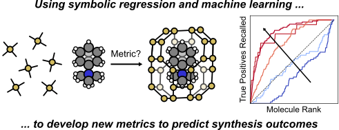

# Benchmarking method for predicting OSDA applicability in zeolite synthesis

This repository contains code and analysis relevant to the manuscript "Learning descriptors to predict organic structure-directing agent applicability in zeolite synthesis" by Alexander J. Hoffman, Mingrou Xie, and Rafael G&oacute;mez-Bombarelli. This work assesses methods to identify the best organic structure-directing agent (OSDA) to synthesize a given zeolite. There are two folders:

1. `data`: contains the cleaned dataset for all OSDA-zeolite pairs for which we could estimate binding entropies (`clean_all_data.csv`), a sample of this dataset used to perform the SISSO run (`sisso_sample.csv`&mdash;formatted to fit the input format for the SISSO code&mdash;and `sisso_sample_for_analysis.csv`&mdash;formatted for analysis in the notebook), the computed formation energies for the zeolites studied in this work (`form_E.csv`), and the expressions that were generated by SISSO from these data (`sisso_expressions.txt`).
2. `notebooks`: contains notebooks for analysis and regenerating figures from the manuscript.

There are 5 Python notebooks in the `notebooks` directory:

1. `classifier_tests.ipynb`: this notebook contains quick tests where we train random forest and neural network (NN) classifiers on the data we have for zeolite synthesis to predict whether or not these methods accurately identify existing OSDA-zeolite pairs.
2. `data_preparation.ipynb`: this notebook contains the code used to clean the data from the previous study from our group ([Schwalbe-Koda et al., Science (2021)](https://www.science.org/doi/full/10.1126/science.abh3350)) and add the binding entropy estimations from the equations of Dauenhauer and Abdelrahman ([ACS Cent. Sci. (2018)](https://pubs.acs.org/doi/full/10.1021/acscentsci.8b00419)).
3. `formation_comparison.ipynb`: this notebook contains a comparison between formation energies of pure silica frameworks computed using DFT (at the PBE-D3 level) and the DREIDING forcefield.
4. `sisso_equation_initial.ipynb`: this notebook contains the code to parse and organize the outputs of a SISSO run from the data gathered in this manuscript. Specifically, it:
    - parses and computes the related values for the descriptors (equations) produced by SISSO
    - fits decision tree and logistic models to those equations to screen them for the best candidate descriptors
5. `analysis.ipynb`: this notebook analyzes the data for our manuscript and contains the code to reproduce the plots. Specifically, it:
    - computes the literature recall area-under-the-curve (AUC) for the various metrics that we constructed in the paper ($E_{ij,T}$, $E_{\text{form},ij,T}$, $\Delta E_{\text{form},ij}$, $A_{ij,T}$, and the best SISSO descriptor $\alpha_T$)
    - reproduces all of the plots in the main text of the manuscript and most of the plots in the supporting information
